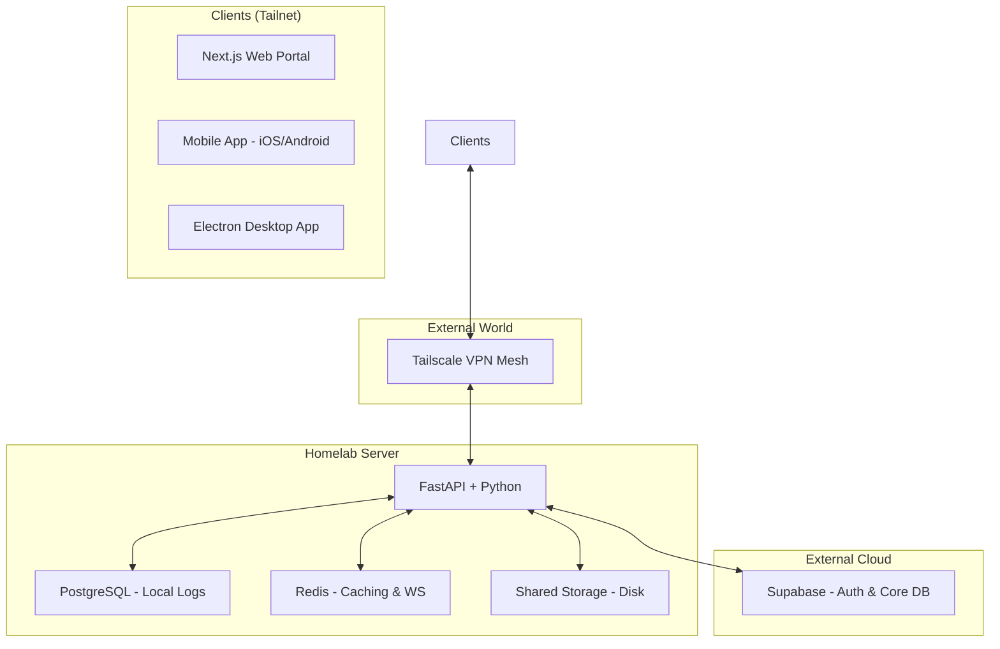

# Synthetix OS - System Overview

Synthetix OS is an integrated ecosystem for personal cloud storage and home automation management. It is designed to run in a private Homelab environment while being accessible securely from anywhere via Tailscale.

## 🏗 Architecture

The system consists of four main pillars:

1.  **Backend (FastAPI)**: The brain of the system. It handles authentication (via Supabase), database management (local PostgreSQL + Cloud Supabase), file storage, and real-time device communication (WebSockets).
2.  **Web Portal (Next.js)**: A premium administrative dashboard accessible from any browser within the Tailnet.
3.  **Mobile App (Expo/React Native)**: A native application for on-the-go management of devices and files.
4.  **Desktop App (Electron)**: A specialized client for deep desktop integration and local file syncing.

### Network Topology

## 🔐 Security

*   **Tailscale**: The entire system is hidden from the public internet. Access is only possible for authenticated devices in your private Tailnet.
*   **Supabase Auth**: Industry-standard JWT-based authentication.
*   **Row Level Security (RLS)**: Database-level protection ensuring users only access their own data.
*   **CORS**: Strict cross-origin policies configured specifically for the app's components.

## 📁 Storage System

*   **Virtual File System**: Files are stored locally on the server but indexed in the database for quick searching and metadata management.
*   **Deduplication**: SHA-256 checksum-based deduplication to save space on large storage volumes.

## 📱 Device Management

*   **Driver Model**: Extensible driver system for IoT devices (Lights, Thermostats, Sockets).
*   **Real-time Updates**: Using WebSockets to push status changes to all connected clients instantly.

## 🔧 Technical Stack

| Component | Technology |
| :--- | :--- |
| **Backend** | Python, FastAPI, SQLAlchemy, Redis, Supabase |
| **Web** | Next.js, Tailwind CSS, Framer Motion, Zustand |
| **Mobile** | React Native, Expo, React Navigation, Zustand |
| **Desktop** | Electron, Vite, React |
| **Infra** | Docker, Docker Compose, Tailscale |

---
*Synthetix OS - Your Private Sky*
